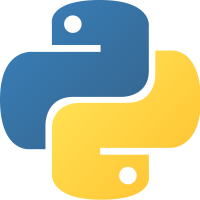

# Cinderella

Objetivo: programacion de Python
**Requisitos**
- Python 3.6 o superior
- Computadora con Windows, Linux o Mac OS
- Editor de texto como [Visual Studio Code](https://code.visualstudio.com/)

------------------------------------------------------------------------------------------------------------------------------------

